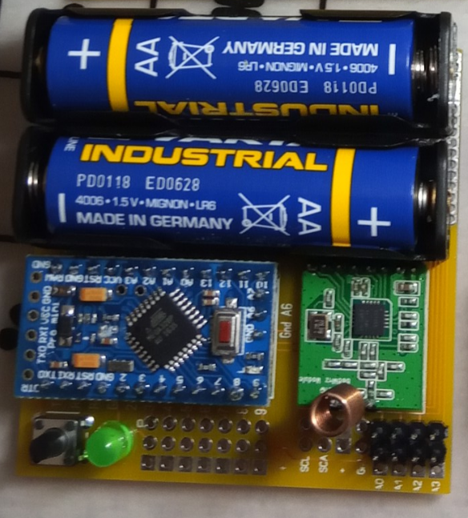

# HB-UNI-Bat
Universal Platine mit Batteriebetrieb für Homematic 868Mhz
## benötigte Hardware
 * 1x Arduino Pro Mini **ATmega328P (3.3V/8MHz)**
 * 1x CC1101 Funkmodul **(868 MHz)**
 * 1x FTDI Adapter (wird nur zum Flashen benötigt)
* 1x Taster 6*6
* 1x LED 5mm
* 1x Widerstand 330 Ohm
* 1x Widerstand 2,2 kOhm - 4,7 kOhm **(wenn One Wire benutzt wird)**
* 2x Batteriehalter AA / AAA (zb. goobay 48677)

[Kontakt via Facebook](https://www.facebook.com/ronny.thomas.83)

[Software je nach Projekt](https://github.com/jp112sdl) von Jérôme

Pinout

Änderungen ab V1.6
* Pinout angepasst -RAW Pins jetzt auch am Ausgang
* Step Up 3,3V direkt Anschluss auf Platine
* I2C Anschlüsse an die gängigsten Sensoren Angepasst (z.b BME280)

Beispiel Sensor **HB-UNI-Sen-TEMP-DS18B20**

